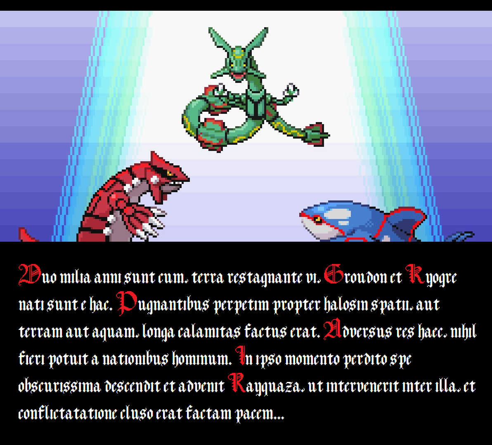

# POKEMON EMERALD LATIN TRANSLATION

This is a project to translate Pokemon Emerald into Latin. 
For now, only the translation files will be kept here. 
These are meant to be combined with the Emerald Decompilation Project (https://github.com/pret/pokeemerald) and then compiled. 
The english base text that is translated is extracted from the Decompilation Project also. 

WIKI: https://github.com/krkpdf/pokemon-emerald-latin/wiki

## WORKFLOW
1. Download the Decompilation Project from https://github.com/pret/pokeemerald 
2. Use the extract_text script to extract all the text from the game (already done, see Text/)
3. Find all the sprites containing english text (to be implemented)
4. Add translations to the text, change sprites, and upload to repo
5. Replace text in Decompilation Project (make.sh!) and compile

I am doing this project to practice my Latin (I am still learning, so expect mistakes) and to create something for Latin learners. My philosophy is better something meh now, than nothing. I believe games make for great language learning (intrinsic motivation, language immersion, simple language and short sentences, union of language with outcomes, you have to extract instructions, etc.). I don't realistically expect to finish this, but I am also not planning on stopping. Feel free to translate parts and correct mistakes.

As for language conventions, I am mostly interested in medieval Catholic writtings and the Vulgate and that is what I want to promote, so that has been my inspiration. I am fine with anglicanisms and new terms, etc, but  don't go too overboard. In rebellion, I do quite prefer using i to j. Also no ligatures since that would require to much work.

https://discord.gg/j55s4pwrhw
